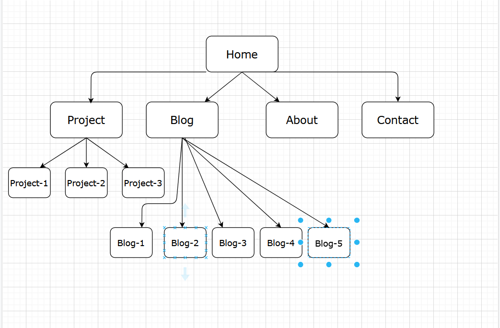
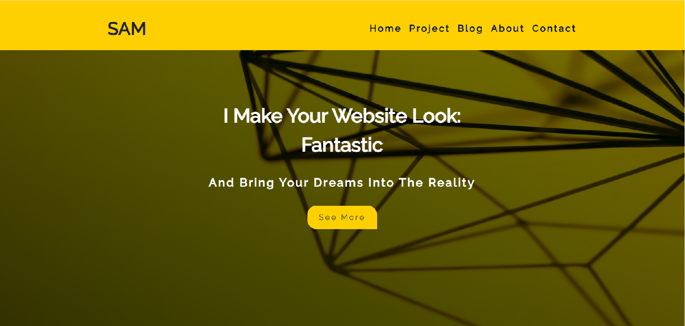
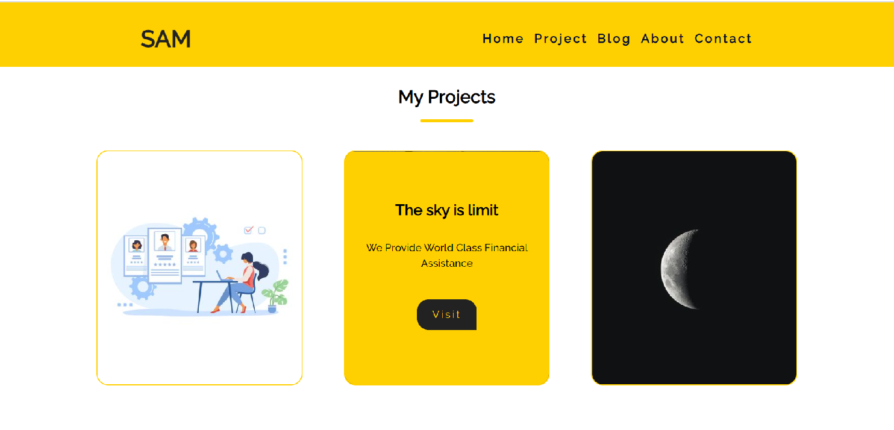
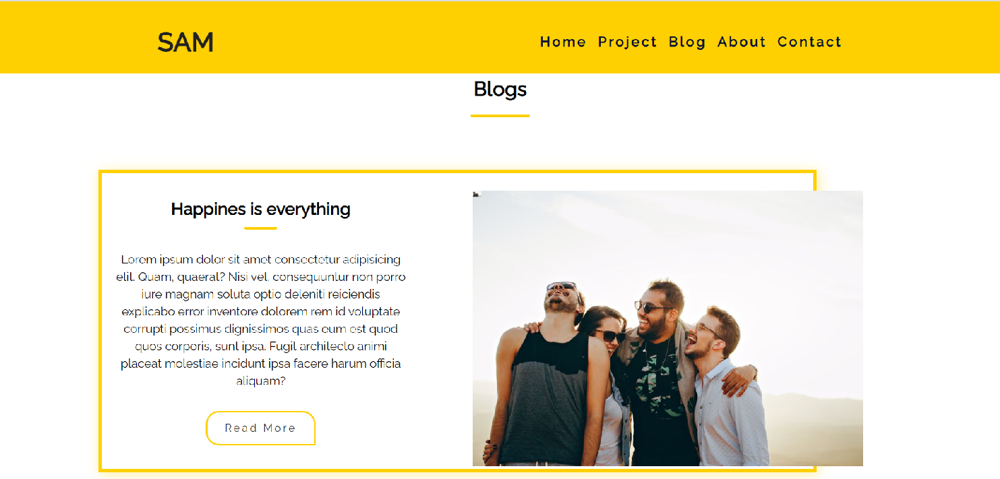
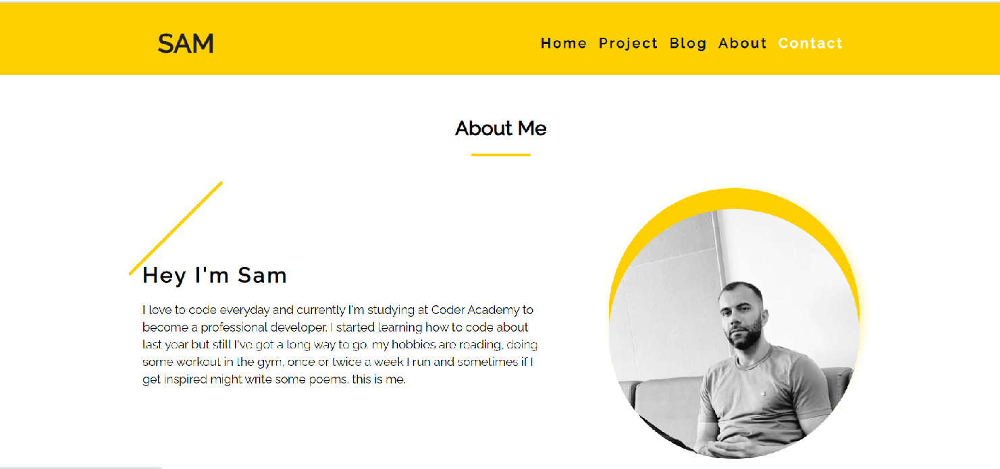
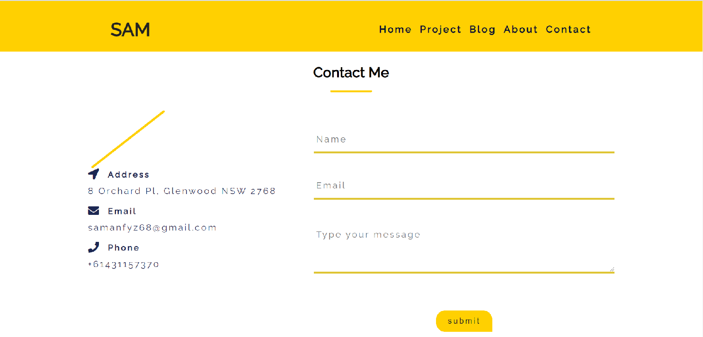

### Hello, the link below is navigate for my portfolio site.

[my-portfolio](https://samanfayazi.netlify.app/)

### the link below is for the github Repo

[github-repo](https://github.com/saman-zdf/third-portfolio)

---

## Description

the website is my portflio and I try to show what can I do, I mainly use Html and sass and some basic Javascript.

### Functionality

from the home pages you can navigate to other pages and also to some external website project, it also has a contact form which is functional and I used formspree.com to insert that to my form.

### siteamp

this is the sitemap of my portfolio

### screen shots of website pages

#### Home page

#### Project page

#### Blog page

#### About page

#### contact page

---

### Target Audience

my target audience mainly are teachers of coder academy and also students, but in the future it might has a different audience such a employer to see if I.m able to do the job or not.

### Tech Stack

I made a repository in Github and then pushed my file through Git to my remote repository and with netlify I did continues deployement to deploy my website into the server.

please forgive me for my broken english I did my best.
